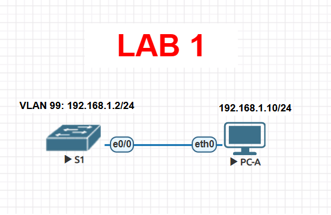

# Lab 01 — Configuración básica de un switch

> Basado en la práctica *Configuración básica del conmutador* de NetAcad, adaptada para ejecutarse en **EVE-NG** con una imagen real de Cisco IOS (no Packet Tracer). El enunciado original con las preguntas de reflexión no se incluye aquí por derechos de autor de Cisco/NetAcad; esta es mi solución de configuración y verificación.

## Objetivo

Dejar un switch recién iniciado en un estado administrable de forma segura: nombre de host, contraseñas cifradas, banner, VLAN de administración separada de la VLAN 1, IP de gestión (IPv4 e IPv6) y acceso remoto por Telnet como primer paso (en el Lab 02 se reemplaza por SSH).

## Topología



*(Imagen de referencia — reemplázala por tu captura real de la topología armada en EVE-NG)*

## Tabla de direccionamiento

| Dispositivo | Interfaz | IPv4 | IPv6 |
|---|---|---|---|
| S1 | VLAN 99 (SVI) | 192.168.1.2 /24 | 2001:db8:acad:1::2 /64, fe80::2 |
| PC-A | NIC | 192.168.1.10 /24 | 2001:db8:acad:1::10 /64 |

## Solución — Configuración de S1

```bash
enable
configure terminal

! Ajustes básicos
no ip domain-lookup
hostname S1
service password-encryption
enable secret class
banner motd #
Unauthorized access is strictly prohibited.
#

! VLAN de administración (separada de la VLAN 1 por buenas prácticas)
vlan 99
 name MANAGEMENT
 exit

! SVI de administración con IPv4 e IPv6
interface vlan 99
 ip address 192.168.1.2 255.255.255.0
 ipv6 address fe80::2 link-local
 ipv6 address 2001:db8:acad:1::2/64
 no shutdown
 exit

! Asignar el/los puertos de acceso del host a la VLAN 99
! (ajusta el rango de interfaces al nombre real que use tu imagen en EVE-NG,
!  p. ej. GigabitEthernet0/1, FastEthernet0/1, etc. — verifícalo con "show ip interface brief")
interface range gigabitEthernet 0/1 - 24
 switchport mode access
 switchport access vlan 99
 exit

! Gateway de administración (simulado, no hay router en esta topología)
ip default-gateway 192.168.1.1

! Consola protegida
line console 0
 password cisco
 logging synchronous
 login
 exit

! Acceso remoto (Telnet por ahora — se endurece con SSH en el Lab 02)
line vty 0 15
 password cisco
 login
 exit

end
copy running-config startup-config
```

## Solución — Configuración de PC-A

| Parámetro | Valor |
|---|---|
| IPv4 | 192.168.1.10 |
| Máscara | 255.255.255.0 |
| Gateway IPv4 (simulado) | 192.168.1.1 |
| IPv6 | 2001:db8:acad:1::10/64 |
| Gateway IPv6 (simulado) | fe80::1 |

## Verificación

```bash
S1# show running-config
S1# show vlan brief
S1# show ip interface vlan 99
S1# show interface vlan 99
```

Desde PC-A:

```bash
ping 192.168.1.2
ping 2001:db8:acad:1::2
telnet 192.168.1.2
```

Resultado esperado: la VLAN 99 aparece **up/up** una vez que al menos un puerto activo queda asignado a ella, el ping IPv4 e IPv6 hacia S1 responde correctamente y el Telnet solicita la contraseña de línea (`cisco`) y luego la de modo privilegiado (`class`).

## Notas de diseño (por qué se configura así)

- **Consola obligatoria al inicio:** un switch de fábrica no tiene IP ni VLAN de administración activa ni credenciales configuradas, así que Telnet/SSH simplemente no tienen forma de establecer sesión; el puerto de consola es el único acceso "fuera de banda" disponible.
- **VLAN 99 en vez de VLAN 1:** la VLAN 1 es la VLAN nativa/predeterminada de todos los puertos y del tráfico de control (CDP, DTP, VTP); moverse a una VLAN de gestión distinta reduce la superficie de ataque si alguien accede a un puerto de acceso general.
- **`service password-encryption`:** cifra (débilmente, tipo 7) las contraseñas en texto plano del `running-config`; no es cifrado fuerte, pero evita que queden a la vista en un `show run` casual. Por eso en el Lab 02 se refuerza con `enable secret` (hash) y luego con SSH.
