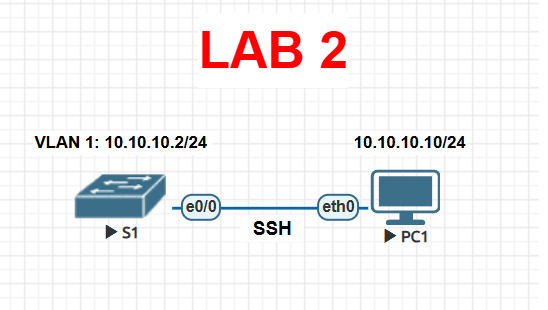

# Lab 02 — Configurar SSH

> Basado en la práctica *Configure SSH* de NetAcad, adaptada para EVE-NG con Cisco IOS real. El enunciado original no se incluye por derechos de autor de Cisco/NetAcad; esta es mi solución de configuración y verificación.

## Objetivo

Reemplazar Telnet por SSH como método de administración remota: cifrar las contraseñas, generar las claves RSA, crear un usuario local y restringir las líneas VTY para que solo acepten SSH.

## Topología




## Tabla de direccionamiento

| Dispositivo | Interfaz | IPv4 | Máscara |
|---|---|---|---|
| S1 | VLAN 1 | 10.10.10.2 | 255.255.255.0 |
| PC1 | NIC | 10.10.10.10 | 255.255.255.0 |

**Punto de partida:** S1 ya tiene Telnet habilitado con contraseña `cisco` tanto en modo EXEC de usuario como en modo EXEC privilegiado (estado inicial del laboratorio).

## Parte 1 — Cifrar las contraseñas existentes

```bash
enable
! contraseña: cisco
configure terminal
service password-encryption
end
show running-config
```

Verifica que las contraseñas ya no aparezcan en texto plano (deben mostrarse como tipo `7`).

## Parte 2 — Cifrar las comunicaciones (SSH)

```bash
configure terminal

! Nombre de dominio requerido para generar las claves RSA
ip domain-name netacad.pka

! Genera el par de claves RSA de 2048 bits
crypto key generate rsa modulus 2048

! Usuario local para autenticación SSH
username admin secret cisco

! Reconfigurar VTY: solo SSH, autenticación contra la base local de usuarios
line vty 0 4
 login local
 transport input ssh
 no password
 exit

end
copy running-config startup-config
```

> Si tu versión de IOS no acepta `crypto key generate rsa modulus 1024` en una sola línea, ejecuta `crypto key generate rsa` sin argumentos: el IOS pedirá interactivamente el tamaño de clave (indica `1024`).

## Verificación

**1. Telnet debe quedar bloqueado:**

```bash
telnet 10.10.10.2
```

Resultado esperado: la conexión es rechazada porque `transport input ssh` ya no permite Telnet en las VTY.

**2. SSH debe funcionar con las credenciales del usuario local:**

Desde PC1 (o el host que uses en EVE-NG):

```bash
ssh -l admin 10.10.10.2
```

Introduce la contraseña `cisco` cuando se solicite. Una vez dentro, valida el acceso privilegiado y guarda la configuración:

```bash
S1> enable
S1# copy running-config startup-config
```

**3. Confirmar el estado de las líneas VTY:**

```bash
S1# show running-config | section line vty
```

Debe mostrar `login local` y `transport input ssh`, sin ninguna línea `password`.

## Notas de diseño (por qué se configura así)

- **`ip domain-name` antes de `crypto key generate rsa`:** el nombre de dominio forma parte del nombre que Cisco IOS asigna internamente al par de claves RSA; sin él, el comando de generación de claves falla.
- **`login local` + `username ... secret ...`:** pasar de una única contraseña compartida (`login` + `password`) a una cuenta nombrada permite trazabilidad (saber *quién* entró) y es requisito para que SSH funcione con autenticación por usuario/contraseña.
- **`transport input ssh`:** por defecto las VTY aceptan tanto Telnet como SSH (`transport input telnet ssh`); limitarlo a `ssh` es lo que efectivamente "apaga" Telnet como vector de acceso remoto en texto plano.
- **RSA de 1024 bits:** es el mínimo que Cisco IOS exige para habilitar SSH; en equipos de producción actuales se recomienda 2048 bits o más, pero muchas imágenes de laboratorio (incluida esta práctica) piden 1024 por compatibilidad con el material del curso.
