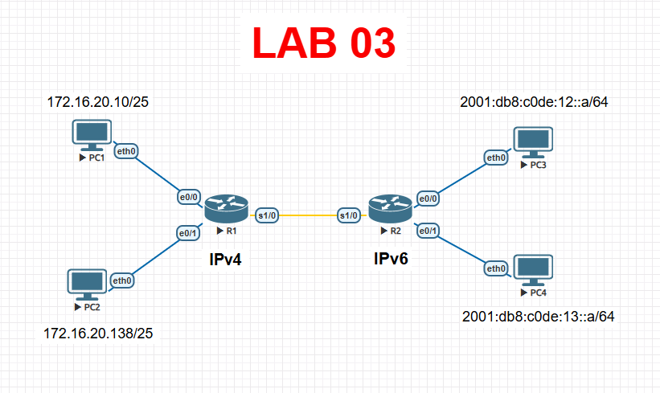

# Lab 03 — Configurar interfaces de router

> Basado en la práctica *Configurar interfaces de router* de NetAcad, adaptada para EVE-NG con Cisco IOS real. El enunciado original no se incluye por derechos de autor de Cisco/NetAcad; esta es mi solución de configuración y verificación.

## Objetivo

Configurar el direccionamiento IPv4 en R1 y sus dos LAN, y el direccionamiento IPv6 en R2 y sus dos LAN, verificando conectividad de extremo a extremo en cada caso.

## Topología




R1 y R2 están unidos por un enlace serial y cada uno tiene dos LAN propias (R1 en IPv4, R2 en IPv6).

## Tabla de direccionamiento

| Dispositivo | Interfaz | Dirección/Prefijo | Gateway |
|---|---|---|---|
| R1 | e0/0 | 172.16.20.1 /25 | N/D |
| R1 | e0/1 | 172.16.20.129 /25 | N/D |
| R1 | s1/0 | 209.165.200.225 /30 | N/D (ya preconfigurada) |
| PC1 | NIC | 172.16.20.10 /25 | 172.16.20.1 |
| PC2 | NIC | 172.16.20.138 /25 | 172.16.20.129 |
| R2 | e0/0 | 2001:db8:c0de:12::1 /64 | N/D |
| R2 | e0/1 | 2001:db8:c0de:13::1 /64 | N/D |
| R2 | s1/0 | 2001:db8:c0de:11::1 /64 + fe80::2 (link-local) | N/D |
| PC3 | NIC | 2001:db8:c0de:12::a /64 | fe80::2 |
| PC4 | NIC | 2001:db8:c0de:13::a /64 | fe80::2 |

**Credenciales base:** contraseña de modo EXEC de usuario `cisco`, contraseña de modo EXEC privilegiado `class`.

## Solución — R1 (IPv4)

```bash
enable
configure terminal
hostname R1
enable secret class

line console 0
 password cisco
 login
 exit
line vty 0 4
 password cisco
 login
 exit

interface ethernet0/0
 ip address 172.16.20.1 255.255.255.128
 no shutdown
 exit

interface ethernet0/1
 ip address 172.16.20.129 255.255.255.128
 no shutdown
 exit

! La interfaz serial1/0 (209.165.200.225/30) ya viene preconfigurada
! como enlace hacia R2; solo verifica que esté "no shutdown".

end
copy running-config startup-config
```

## Solución — R2 (IPv6)

```bash
enable
configure terminal
hostname R2
enable secret class
ipv6 unicast-routing

interface ethernet0/0
 ipv6 address 2001:db8:c0de:12::1/64
 no shutdown
 exit

interface ethernet0/1
 ipv6 address 2001:db8:c0de:13::1/64
 no shutdown
 exit

interface serial1/0
 ipv6 address fe80::2 link-local
 ipv6 address 2001:db8:c0de:11::1/64
 no shutdown
 exit

end
copy running-config startup-config
```

> `ipv6 unicast-routing` es obligatorio en un router Cisco para que reenvíe paquetes IPv6 entre interfaces; sin este comando, R2 solo tendría IPv6 configurado localmente pero no enrutaría entre sus LAN.

## Solución — Hosts

| Host | IP | Máscara/Prefijo | Gateway |
|---|---|---|---|
| PC1 | 172.16.20.10 | 255.255.255.128 | 172.16.20.1 |
| PC2 | 172.16.20.138 | 255.255.255.128 | 172.16.20.129 |
| PC3 | 2001:db8:c0de:12::a | /64 | fe80::2 |
| PC4 | 2001:db8:c0de:13::a | /64 | fe80::2 |

## Verificación

```bash
R1# show ip interface brief
R2# show ipv6 interface brief
```

Desde PC1:
```bash
ping 172.16.20.138
```

Desde PC3:
```bash
ping 2001:db8:c0de:13::a
```

Resultado esperado: ambos routers muestran sus interfaces LAN en estado `up/up`, y los pings entre PC1↔PC2 (IPv4) y PC3↔PC4 (IPv6) se completan correctamente cruzando el router correspondiente.

## Notas de diseño

- **Prefijo /25 en R1:** cada interfaz LAN de R1 usa una submáscara de 25 bits (255.255.255.128), es decir, dos subredes de 126 hosts útiles cada una dentro del bloque 172.16.20.0/24 — por eso G0/0 usa la primera mitad (.1 a .126) y G0/1 la segunda (.129 a .254).
- **Direcciones link-local (`fe80::`) en IPv6:** se generan automáticamente en cada interfaz, pero aquí se fija manualmente `fe80::2` en el enlace serial para que sea predecible y fácil de referenciar como gateway en los hosts IPv6, en vez de depender de la dirección aleatoria/EUI-64 que asignaría el router por defecto.
