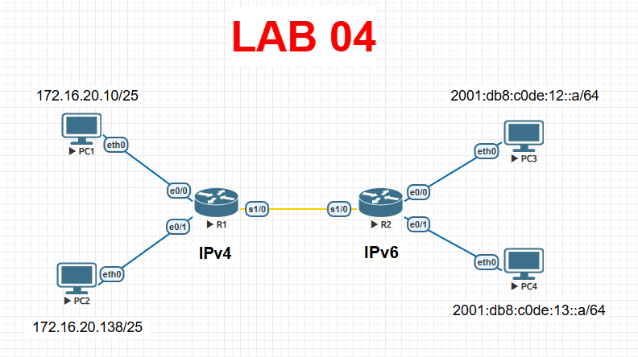

# Lab 04 — Verificar redes conectadas directamente

> Basado en la práctica *Verificar redes conectadas directamente* de NetAcad, adaptada para EVE-NG con Cisco IOS real. El enunciado original no se incluye por derechos de autor de Cisco/NetAcad; esta es mi solución de verificación y corrección.

## Objetivo

A diferencia del Lab 03 (donde se configura desde cero), aquí R1 y R2 **ya tienen una configuración previa con al menos un error**. La tarea es verificar el estado de las interfaces y direcciones con comandos de `show` filtrados, detectar la falla y corregirla, sin volver a configurar todo desde cero.

## Topología




## Tabla de direccionamiento (estado correcto esperado)

| Dispositivo | Interfaz | Dirección/Prefijo | Gateway |
|---|---|---|---|
| R1 | e0/0 | 172.16.20.1 /25 | N/D |
| R1 | e0/1 | 172.16.20.129 /25 | N/D |
| R1 | s1/0 | 209.165.200.225 /30 | N/D |
| PC1 | NIC | 172.16.20.10 /25 | 172.16.20.1 |
| PC2 | NIC | 172.16.20.138 /25 | 172.16.20.129 |
| R2 | e0/0 | 2001:db8:c0de:12::1 /64 | N/D |
| R2 | e0/1 | 2001:db8:c0de:13::1 /64 | N/D |
| R2 | s1/0 | 2001:db8:c0de:11::1 /64 + fe80::2 | N/D |
| PC3 | NIC | 2001:db8:c0de:12::a /64 | fe80::2 |
| PC4 | NIC | 2001:db8:c0de:13::a /64 | fe80::2 |

**Credenciales base:** contraseña de modo EXEC de usuario `cisco`, contraseña de modo EXEC privilegiado `class`.

## Parte 1 — Verificar y corregir IPv4 en R1

Comandos de verificación (usando filtros de salida, que es justamente lo que evalúa este laboratorio):

```bash
R1# show ip interface brief | exclude unassigned
R1# show ip route | begin Gate
R1# show interface | include Desc|conn
R1# show interface e0/0 | include duplex
```

- `show ip interface brief | exclude unassigned` — descarta del listado cualquier interfaz sin IP, para enfocarte solo en las que importan.
- `show ip route | begin Gate` — imprime la tabla de rutas empezando en la línea que contiene "Gate" (útil para ver rápido la *Gateway of last resort*, que en este laboratorio no está configurada porque no se pidió una ruta predeterminada).
- Compara la salida contra la tabla de direccionamiento de arriba; si alguna interfaz de R1 tiene una IP distinta o está en `administratively down`, corrígela:

```bash
configure terminal
interface ethernet0/0
 ip address 172.16.20.1 255.255.255.128
 no shutdown
 exit
interface ethernet0/1
 ip address 172.16.20.129 255.255.255.128
 no shutdown
 exit
end
copy running-config startup-config
```

## Parte 2 — Verificar y corregir IPv6 en R2

```bash
R2# show ipv6 interface brief
```

El fallo típico de este laboratorio es una dirección IPv6 incorrecta en `e0/1` (por ejemplo `2001:db8:c0de:14::1/64` en vez de la `...13::1/64` que pide la tabla). Como una interfaz puede tener varias direcciones IPv6 asignadas a la vez, **primero se retira la incorrecta y luego se agrega la correcta**:

```bash
configure terminal
interface ethernet0/1
 no ipv6 address 2001:db8:c0de:14::1/64
 ipv6 address 2001:db8:c0de:13::1/64
 exit
end
copy running-config startup-config
```

Verifica el resultado filtrando el running-config (los filtros de IPv6 no se pueden usar sobre `show ipv6 route`, pero sí sobre `show run`):

```bash
R2# show run | include ipv6|interface
```

Debe mostrar exactamente una dirección IPv6 por interfaz Gigabit, coincidiendo con la tabla de direccionamiento.

## Verificación final de conectividad

```bash
PC1> ping 172.16.20.138
PC3> ping 2001:db8:c0de:13::a
```

Ambos deben responder correctamente una vez corregidas las direcciones.

## Notas de diseño

- **`exclude` / `include` / `begin` como flujo de trabajo real:** en un router de producción con decenas de interfaces, filtrar la salida de los `show` es la diferencia entre encontrar el problema en segundos o desplazarte por páginas de texto. Vale la pena practicar estos filtros aunque el laboratorio sea pequeño.
- **Por qué se retira la IPv6 antes de agregar la nueva:** a diferencia de IPv4 (donde asignar una nueva IP reemplaza la anterior en la misma interfaz), IPv6 permite múltiples direcciones simultáneas por diseño (una interfaz puede participar en varias redes o tener varias direcciones globales). Si no retiras la incorrecta, quedaría conviviendo con la correcta y el diagnóstico se complica.
