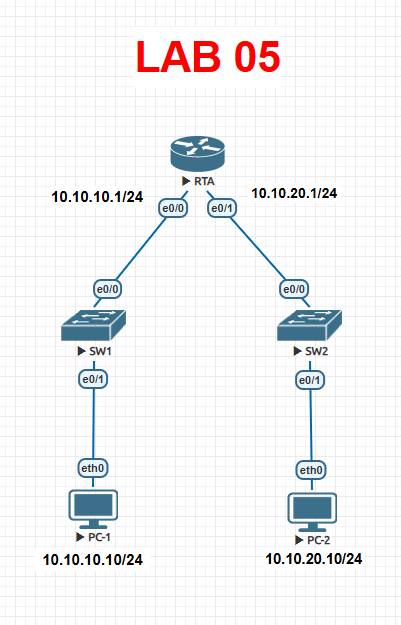

# Lab 05 — Implementar una red pequeña

> Basado en la práctica *Implementar una red pequeña* de NetAcad, adaptada para EVE-NG con Cisco IOS real. El enunciado original no se incluye por derechos de autor de Cisco/NetAcad; esta es mi solución de configuración y verificación.

## Objetivo

Armar una red pequeña de tres capas (router + dos switches + dos PC) desde cero: cableado, direccionamiento, contraseñas, banners, descripciones de interfaz y gestión remota de los switches.

## Topología




## Conexiones físicas

| Desde | Puerto | Hacia | Puerto |
|---|---|---|---|
| RTA | e0/0 | SW1 | e0/1 (uplink) |
| RTA | e0/1 | SW2 | e0/1 (uplink) |
| SW1 | e0/1 | PC-1 | NIC |
| SW2 | e0/1 | PC-2 | NIC |

> En EVE-NG, si usas una imagen IOSvL2 para los switches, los nombres de puerto pueden ser `GigabitEthernet0/0`–`0/3` en vez de `Ethernet0/1`; ajusta los nombres de interfaz de este documento a los que te muestre `show ip interface brief` en tu propio laboratorio.

## Tabla de direccionamiento

| Dispositivo | Interfaz | Dirección | Máscara | Gateway |
|---|---|---|---|---|
| RTA | e0/0 | 10.10.10.1 | 255.255.255.0 | N/D |
| RTA | e0/1 | 10.10.20.1 | 255.255.255.0 | N/D |
| SW1 | VLAN 1 | 10.10.10.2 | 255.255.255.0 | 10.10.10.1 |
| SW2 | VLAN 1 | 10.10.20.2 | 255.255.255.0 | 10.10.20.1 |
| PC-1 | NIC | 10.10.10.10 (cualquier IP libre de la LAN) | 255.255.255.0 | 10.10.10.1 |
| PC-2 | NIC | 10.10.20.10 (cualquier IP libre de la LAN) | 255.255.255.0 | 10.10.20.1 |

**Requisitos de seguridad del enunciado:** contraseña de modo privilegiado `Ciscoenpa55` y contraseña de línea (consola y VTY) `Ciscolinepa55` en los tres dispositivos, con todas las líneas aceptando conexiones.

## Solución — RTA (router)

```bash
enable
configure terminal
hostname RTA
enable secret Ciscoenpa55

banner motd #
Acceso restringido unicamente a personal autorizado.
#

line console 0
 password Ciscolinepa55
 login
 exit
line vty 0 4
 password Ciscolinepa55
 login
 exit

interface ethernet0/0
 description Enlace hacia SW1 -- LAN 10.10.10.0/24
 ip address 10.10.10.1 255.255.255.0
 no shutdown
 exit

interface ethernet0/1
 description Enlace hacia SW2 -- LAN 10.10.20.0/24
 ip address 10.10.20.1 255.255.255.0
 no shutdown
 exit

end
copy running-config startup-config
```

## Solución — SW1

```bash
enable
configure terminal
hostname SW1
enable secret Ciscoenpa55

interface vlan 1
 description Interfaz de administracion
 ip address 10.10.10.2 255.255.255.0
 no shutdown
 exit

ip default-gateway 10.10.10.1

line console 0
 password Ciscolinepa55
 login
 exit
line vty 0 15
 password Ciscolinepa55
 login
 exit

end
copy running-config startup-config
```

## Solución — SW2

```bash
enable
configure terminal
hostname SW2
enable secret Ciscoenpa55

interface vlan 1
 description Interfaz de administracion
 ip address 10.10.20.2 255.255.255.0
 no shutdown
 exit

ip default-gateway 10.10.20.1

line console 0
 password Ciscolinepa55
 login
 exit
line vty 0 15
 password Ciscolinepa55
 login
 exit

end
copy running-config startup-config
```

## Solución — Hosts

| Host | IP | Máscara | Gateway |
|---|---|---|---|
| PC-1 | 10.10.10.10 | 255.255.255.0 | 10.10.10.1 |
| PC-2 | 10.10.20.10 | 255.255.255.0 | 10.10.20.1 |

## Verificación

```bash
RTA# show ip interface brief
SW1# show interface vlan 1
SW2# show interface vlan 1
```

Desde PC-1:
```bash
ping 10.10.20.10      ! PC-2, cruzando RTA
ping 10.10.10.2       ! SW1 (gestión)
ping 10.10.20.2       ! SW2 (gestión, cruzando RTA)
```

Resultado esperado: los tres ping responden correctamente, confirmando que RTA enruta entre las dos LAN y que ambos switches son alcanzables para administración remota desde cualquier punto de la red.

## Notas de diseño

- **`ip default-gateway` en los switches, no `ip route`:** un switch de capa 2 (como el 2960/IOSvL2) no enruta paquetes; `ip default-gateway` solo le dice a la SVI de administración (VLAN 1) hacia dónde mandar el tráfico de gestión (SSH, ICMP, syslog, etc.) cuando el destino no está en su misma subred. Es exactamente lo que el enunciado pide con "configurar los switches para que puedan enviar datos a hosts en redes remotas".
- **Contraseña única para todas las líneas:** en un entorno de laboratorio esto es aceptable para simplificar; en un despliegue real, la buena práctica es reemplazar `password` + `login` en las VTY por `login local` con usuarios nombrados (como se hizo en el Lab 02 con SSH), para tener trazabilidad de quién se conecta.
- **`description` en las interfaces:** no cambia el comportamiento de la red, pero es una de las prácticas más subestimadas: documentar en el propio dispositivo qué hay al otro lado de cada enlace ahorra minutos (u horas) al diagnosticar una falla meses después.
