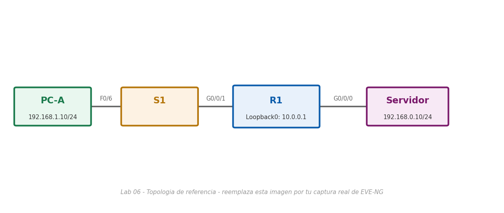

# Lab 06 — Configurar los parámetros básicos del router (modo físico)

> Basado en la práctica *Configure los parámetros básicos del router - Modo Físico* de NetAcad, adaptada para EVE-NG con Cisco IOS real. El enunciado original no se incluye por derechos de autor de Cisco/NetAcad; esta es mi solución de configuración y verificación.

## Objetivo

Repaso integral de endurecimiento de un router: nombre de dominio, cifrado de contraseñas, longitud mínima de contraseña, usuario SSH, claves RSA, bloqueo por intentos fallidos, banner, IPv6, y direccionamiento IPv4/IPv6 en tres interfaces (dos físicas + una loopback), verificando todo por SSH.

## Topología



*(Imagen de referencia — reemplázala por tu captura real de la topología armada en EVE-NG: PC-A — S1 — R1 — Servidor)*

## Tabla de direccionamiento

| Dispositivo | Interfaz | IPv4 | IPv6 |
|---|---|---|---|
| R1 | G0/0/0 (hacia Servidor) | 192.168.0.1 /24 | 2001:db8:acad::1/64, fe80::1 |
| R1 | G0/0/1 (hacia S1/PC-A) | 192.168.1.1 /24 | 2001:db8:acad:1::1/64, fe80::1 |
| R1 | Loopback0 | 10.0.0.1 /24 | 2001:db8:acad:2::1/64, fe80::1 |
| PC-A | NIC | 192.168.1.10 /24, GW 192.168.1.1 | 2001:db8:acad:1::10/64, GW fe80::1 |
| Servidor | NIC | 192.168.0.10 /24, GW 192.168.0.1 | 2001:db8:acad::10/64, GW fe80::1 |

## Requisitos de endurecimiento

- Dominio: `CCNA-lab.com`
- Usuario SSH: `SSHadmin` / contraseña secreta `55Hadm!n2020`
- Claves RSA: módulo 1024
- Contraseña de modo privilegiado: `$cisco!PRIV*`
- Contraseña de consola: `$cisco!!CON*`, desconexión tras 4 minutos de inactividad
- Contraseña de VTY: `$cisco!!VTY*`, solo SSH, autenticación contra la base local, desconexión tras 4 minutos
- Bloqueo de inicios de sesión VTY: 3 intentos fallidos en 60 segundos → bloqueo de 2 minutos
- Longitud mínima de contraseña: 12 caracteres

## Solución — R1

```bash
enable
configure terminal

hostname R1
ip domain-name CCNA-lab.com
service password-encryption
security passwords min-length 12

username SSHadmin secret 55Hadm!n2020
crypto key generate rsa modulus 1024

enable secret $cisco!PRIV*

banner motd #
Unauthorized access is strictly prohibited.
#

login block-for 120 attempts 3 within 60

line console 0
 password $cisco!!CON*
 exec-timeout 4 0
 login
 exit

line vty 0 4
 password $cisco!!VTY*
 exec-timeout 4 0
 transport input ssh
 login local
 exit

ipv6 unicast-routing

interface GigabitEthernet0/0/0
 description Enlace hacia el Servidor
 ip address 192.168.0.1 255.255.255.0
 ipv6 address fe80::1 link-local
 ipv6 address 2001:db8:acad::1/64
 no shutdown
 exit

interface GigabitEthernet0/0/1
 description Enlace hacia S1 y PC-A
 ip address 192.168.1.1 255.255.255.0
 ipv6 address fe80::1 link-local
 ipv6 address 2001:db8:acad:1::1/64
 no shutdown
 exit

interface Loopback0
 description Loopback para pruebas de administracion SSH
 ip address 10.0.0.1 255.255.255.0
 ipv6 address fe80::1 link-local
 ipv6 address 2001:db8:acad:2::1/64
 exit

clock set 14:00:00 15 September 2026

end
copy running-config startup-config
```

> `login block-for 120 attempts 3 within 60` es global (no de línea): si en cualquier ventana de 60 segundos se registran 3 intentos fallidos de inicio de sesión (por cualquier línea, incluida VTY), el router deja de aceptar nuevos intentos durante 120 segundos. Es una defensa simple contra ataques de fuerza bruta.

## Solución — Hosts

| Host | IPv4 | Máscara | Gateway | IPv6 | Gateway IPv6 |
|---|---|---|---|---|---|
| PC-A | 192.168.1.10 | 255.255.255.0 | 192.168.1.1 | 2001:db8:acad:1::10/64 | fe80::1 |
| Servidor | 192.168.0.10 | 255.255.255.0 | 192.168.0.1 | 2001:db8:acad::10/64 | fe80::1 |

## Verificación

```bash
R1# show ip interface brief
R1# show ipv6 interface brief
R1# show ip route | include C
```

Desde PC-A:
```bash
ping 192.168.0.10
ping 2001:db8:acad::10
ssh -l SSHadmin 10.0.0.1
```

Al conectar por SSH a la Loopback0, ingresa la contraseña `55Hadm!n2020`; una vez dentro, `enable` con `$cisco!PRIV*` y explora:

```bash
R1# show version
R1# show version | include register
R1# show startup-config
R1# show running-config | section vty
```

## Notas de diseño

- **Por qué usar la Loopback0 para SSH y no una interfaz física:** una interfaz loopback nunca cae (no depende de un enlace físico ni de autonegociación), por lo que es el destino de administración más estable para probar el acceso remoto — una práctica común en redes reales para la IP de gestión de un dispositivo.
- **`ip domain-name` + `crypto key generate rsa`:** igual que en el Lab 02, el nombre de dominio es obligatorio antes de generar las llaves RSA que habilitan SSH.
- **Guardar antes de recargar:** si el router se reinicia sin ejecutar `copy running-config startup-config`, toda la configuración hecha en esta sesión —incluyendo las contraseñas, el hostname y el direccionamiento— se pierde, y el router vuelve exactamente al estado que tenía en el último `startup-config` guardado (o a la configuración de fábrica si nunca se guardó nada).
- **Telnet como riesgo de seguridad:** al restringir las VTY a `transport input ssh`, se elimina Telnet como vector de acceso remoto porque viaja en texto plano — cualquiera que capture el tráfico de la red (por ejemplo con un switch mal segmentado o un puerto en modo promiscuo) podría leer usuario y contraseña directamente.
