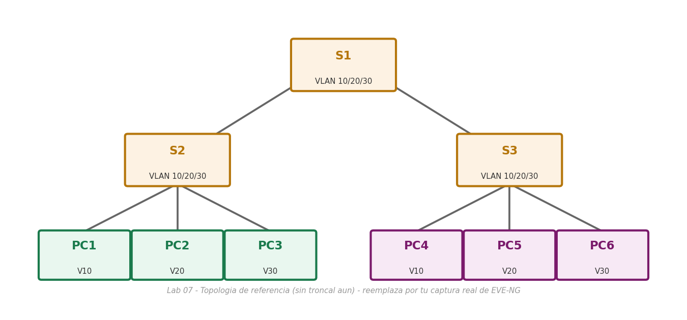

# Lab 07 — Configuración de VLAN

> Basado en la práctica *Configuración de redes VLAN* de NetAcad, adaptada para EVE-NG con Cisco IOS real. El enunciado original no se incluye por derechos de autor de Cisco/NetAcad; esta es mi solución de configuración y verificación.

## Objetivo

Crear y nombrar VLAN en tres switches de acceso (S1, S2, S3) y asignar puertos de acceso a cada una, observando qué ocurre con la conectividad cuando las VLAN existen pero **todavía no hay un enlace troncal** entre switches (ese es justamente el tema del Lab 08).

## Topología



*(Imagen de referencia — reemplázala por tu captura real de la topología armada en EVE-NG: 6 PC repartidas en 3 VLAN, conectadas a S1/S2/S3)*

## Tabla de direccionamiento

| Dispositivo | IP | Máscara | VLAN |
|---|---|---|---|
| PC1 | 172.17.10.21 | 255.255.255.0 | 10 |
| PC2 | 172.17.20.22 | 255.255.255.0 | 20 |
| PC3 | 172.17.30.23 | 255.255.255.0 | 30 |
| PC4 | 172.17.10.24 | 255.255.255.0 | 10 |
| PC5 | 172.17.20.25 | 255.255.255.0 | 20 |
| PC6 | 172.17.30.26 | 255.255.255.0 | 30 |

## Parte 1 — Estado inicial (solo VLAN 1)

Recién iniciados, los tres switches tienen todos sus puertos en la VLAN 1 (`show vlan brief`), así que las PC que comparten la misma red IP pueden hacer ping entre sí (PC1↔PC4, PC2↔PC5, PC3↔PC6) simplemente porque están en el mismo dominio de difusión, sin que exista todavía ninguna VLAN adicional.

## Parte 2 — Crear y nombrar las VLAN (en S1, S2 y S3)

Los mismos comandos se repiten en los tres switches:

```bash
enable
configure terminal

vlan 10
 name Faculty/Staff
 exit
vlan 20
 name Students
 exit
vlan 30
 name Guest(Default)
 exit
vlan 99
 name Management&Native
 exit
vlan 150
 name VOICE
 exit

end
copy running-config startup-config
```

Verificación:
```bash
show vlan brief
```

## Parte 3 — Asignar VLAN a los puertos

**En S2:**

```bash
configure terminal
interface f0/11
 switchport mode access
 switchport access vlan 10
 exit
interface f0/18
 switchport mode access
 switchport access vlan 20
 exit
interface f0/6
 switchport mode access
 switchport access vlan 30
 exit
end
copy running-config startup-config
```

**En S3** (mismas asignaciones que S2, más el puerto del teléfono IP):

```bash
configure terminal
interface f0/11
 switchport mode access
 switchport access vlan 10
 mls qos trust cos
 switchport voice vlan 150
 exit
interface f0/18
 switchport mode access
 switchport access vlan 20
 exit
interface f0/6
 switchport mode access
 switchport access vlan 30
 exit
end
copy running-config startup-config
```

> `switchport voice vlan 150` + `switchport access vlan 10` en la misma interfaz es el patrón estándar para un puerto donde se conecta un teléfono IP con una PC detrás: el tráfico de datos de la PC viaja etiquetado (o no) en la VLAN de acceso (10), y el propio teléfono etiqueta su tráfico de voz con la VLAN de voz (150) sobre el mismo cable físico. `mls qos trust cos` le dice al switch que confíe en el marcado de prioridad (CoS) que ya trae el tráfico del teléfono, en vez de reclasificarlo.

## Parte 4 — Verificar la pérdida de conectividad entre switches

Con las VLAN ya asignadas, intenta:

```bash
PC1> ping 172.17.10.24   ! PC4, misma VLAN 10, pero en otro switch
```

**El ping falla**, aunque PC1 y PC4 estén en la misma VLAN 10. La razón es la que señala la salida de `show vlan brief` en S2: el puerto que conecta a los demás switches (`Gig0/1`) sigue asignado a la **VLAN 1** por defecto, junto con todos los puertos que no se reconfiguraron. Un puerto de acceso solo transporta el tráfico de **una** VLAN a la vez — para que dos switches distintos compartan varias VLAN a través de un mismo cable físico hace falta un **enlace troncal** que etiquete las tramas (802.1Q), y eso todavía no existe en esta topología.

## Notas de diseño

- **VLAN sin enlace troncal = islas aisladas:** crear la misma VLAN en varios switches no basta para que sus miembros se vean entre sí; sin un troncal (o sin que el puerto entre switches esté en esa VLAN de acceso), cada switch administra su VLAN 10 como un dominio de difusión separado del resto. Esto se resuelve en el Lab 08 configurando `switchport mode trunk` entre los switches.
- **Nombres de VLAN "que importan":** Cisco permite nombrar la VLAN 1 a 1005 con hasta 32 caracteres sensibles a mayúsculas/minúsculas; usar nombres descriptivos (`Faculty/Staff`, `Students`) en vez de dejarlos como `VLAN0010` facilita enormemente la lectura de un `show vlan brief` en una red con más de 3 o 4 VLAN.
- **Beneficio real de las VLAN:** más allá de organizar el tráfico, separar dominios de difusión limita el alcance de tormentas de broadcast y de ataques de Capa 2 (por ejemplo, ARP spoofing) a solo los hosts de esa VLAN, y permite aplicar políticas de seguridad (ACL, QoS) por grupo lógico sin depender de la ubicación física del cable.
