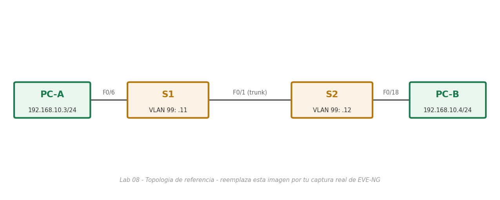

# Lab 08 — Configurar VLAN y enlaces troncales

> Basado en la práctica *Configurar VLAN y enlaces troncales - Modo físico* de NetAcad, adaptada para EVE-NG con Cisco IOS real. El enunciado original no se incluye por derechos de autor de Cisco/NetAcad; esta es mi solución de configuración y verificación.

## Objetivo

Armar dos switches con parámetros básicos, crear VLAN y asignarlas a puertos, mover la administración de VLAN 1 a VLAN 99, y finalmente levantar un enlace troncal 802.1Q entre ambos switches — primero dejando que **DTP** lo negocie automáticamente, y luego configurándolo manualmente.

## Topología



*(Imagen de referencia — reemplázala por tu captura real de la topología armada en EVE-NG: PC-A — S1 — S2 — PC-B, con S1↔S2 unidos por F0/1)*

## Tabla de direccionamiento

| Dispositivo | Interfaz | IP | Máscara | Gateway |
|---|---|---|---|---|
| S1 | VLAN 1 → luego VLAN 99 | 192.168.1.11 | 255.255.255.0 | N/A |
| S2 | VLAN 1 → luego VLAN 99 | 192.168.1.12 | 255.255.255.0 | N/A |
| PC-A | NIC | 192.168.10.3 | 255.255.255.0 | 192.168.10.1 |
| PC-B | NIC | 192.168.10.4 | 255.255.255.0 | 192.168.10.1 |

## Parte 1 — Parámetros básicos (S1 y S2, mismos comandos en ambos)

```bash
enable
configure terminal

hostname S1
enable secret class
service password-encryption

banner motd #
Unauthorized access is strictly prohibited.
#

line console 0
 password cisco
 login
 exit
line vty 0 15
 password cisco
 login
 exit

interface vlan 1
 ip address 192.168.1.11 255.255.255.0
 no shutdown
 exit

! Apagar los puertos que no se usan en esta actividad
interface range f0/2-5, f0/7-24, gig0/2
 shutdown
 exit

clock set 14:00:00 15 September 2026
end
copy running-config startup-config
```

(En S2, mismo bloque con `hostname S2` e IP `192.168.1.12`.)

**Prueba de conectividad tras la Parte 1:** PC-A y PC-B **no** pueden hacer ping entre sí todavía (están en redes distintas, 192.168.10.x, sin un router que las una), pero **sí** pueden hacer ping a su switch local (S1 responde a PC-A, S2 a PC-B) porque ambos están en la misma VLAN 1. S1 y S2 tampoco pueden hacer ping entre sí en este punto salvo que el enlace F0/1 ya esté activo en VLAN 1 en ambos extremos — si fallara, la causa más común es que el puerto siga administrativamente apagado o en una VLAN distinta a la esperada.

## Parte 2 — Crear VLAN y asignar puertos

```bash
configure terminal
vlan 10
 name Operations
vlan 20
 name Parking_Lot
vlan 99
 name Management
vlan 1000
 name Native
end
copy running-config startup-config
```

*(Se ejecuta igual en S1 y en S2.)*

**Asignar el host y migrar la administración a VLAN 99 (en S1):**

```bash
configure terminal
interface f0/6
 switchport mode access
 switchport access vlan 10
 exit

interface vlan 1
 no ip address
 exit
interface vlan 99
 ip address 192.168.1.11 255.255.255.0
 no shutdown
 exit
end
copy running-config startup-config
```

(En S2: mismo procedimiento, asignando su puerto de host a VLAN 10 y migrando a `192.168.1.12` en VLAN 99.)

**Resultado esperado en este punto:** la VLAN 99 en `show ip interface brief` aparece **down/down** hasta que el enlace troncal quede configurado en la Parte 4 — porque, igual que en el Lab 07, sin un troncal que lleve la VLAN 99 de un switch al otro, cada SVI de administración queda aislada en su propio switch. Por la misma razón, S1 no puede hacer ping a S2 ni PC-A a PC-B todavía.

## Parte 3 — Mantener asignaciones de puertos y base de datos de VLAN

```bash
configure terminal

! Asignar un rango de puertos a VLAN 99
interface range f0/11-24
 switchport mode access
 switchport access vlan 99
 exit

! Reasignar dos puertos puntuales a VLAN 20
interface range f0/11, f0/21
 switchport mode access
 switchport access vlan 20
 exit

! Quitar la asignación de acceso de un puerto (vuelve a la VLAN 1 por defecto)
interface f0/24
 no switchport access vlan
 exit

! Crear una VLAN "al vuelo" asignándola directamente a un puerto
interface f0/24
 switchport access vlan 30
 exit
! IOS advierte: "Access VLAN does not exist. Creating vlan 30" y la agrega a la base de datos

! Eliminar esa VLAN de la base de datos
no vlan 30

! El puerto f0/24 queda "huérfano" (vlan inexistente) hasta reasignarlo
interface f0/24
 no switchport access vlan
 exit
end
copy running-config startup-config
```

> **Por qué reasignar antes de borrar una VLAN de la base de datos:** si eliminas una VLAN mientras un puerto sigue apuntando a ella, ese puerto queda inactivo (no reenvía tráfico) hasta que lo reasignes a una VLAN válida — el switch no lo regresa automáticamente a la VLAN 1. En una red en producción, esto se traduce en un host desconectado sin previo aviso.

## Parte 4 — Configurar el enlace troncal 802.1Q

**Paso 1 — Dejar que DTP negocie el troncal (en S1):**

```bash
configure terminal
interface f0/1
 switchport mode dynamic desirable
 exit
end
```

El modo por defecto de un puerto 2960/IOSvL2 es `dynamic auto`; como `dynamic desirable` en S1 sí inicia la negociación activamente, el enlace sube a troncal en ambos extremos sin tocar nada en S2. Verifica con:

```bash
show interfaces trunk
```

**Paso 2 — Fijar el troncal manualmente y cambiar la VLAN nativa (en S1 y en S2):**

```bash
configure terminal
interface f0/1
 switchport mode trunk
 switchport trunk native vlan 1000
 exit
end
copy running-config startup-config
```

Verifica que ambos lados coincidan en la VLAN nativa:

```bash
show interfaces trunk
```

## Verificación final

```bash
S1# ping 192.168.1.12
PC-A> ping 192.168.10.4
PC-A> ping 192.168.1.11
PC-B> ping 192.168.1.12
```

Con el troncal ya activo y ambos extremos en modo `trunk` con la misma VLAN nativa, todos estos pings deben responder correctamente.

## Notas de diseño

- **`dynamic desirable` vs `switchport mode trunk` manual:** dejar que DTP negocie es cómodo, pero en producción se prefiere fijar el modo manualmente (`trunk` + `nonegotiate` si se quiere ir un paso más allá) porque un puerto en modo dinámico puede ser inducido por un atacante a convertirse en troncal (VLAN hopping) si logra imitar los mensajes DTP del otro extremo.
- **Coincidencia de VLAN nativa obligatoria:** si los dos extremos de un troncal 802.1Q no acuerdan la misma VLAN nativa, el switch genera advertencias de "native VLAN mismatch" y el tráfico sin etiquetar de esa VLAN puede terminar en el dominio equivocado — es uno de los errores de trunking más comunes y más fáciles de pasar por alto.
- **Para que VLAN 10 hable con VLAN 99 (o cualquier otra):** hace falta un dispositivo de Capa 3 (un router, o un switch multicapa con `ip routing`) — el switch por sí solo solo conmuta dentro de la misma VLAN. Este es exactamente el tema del Lab 10 (Router-on-a-Stick).
