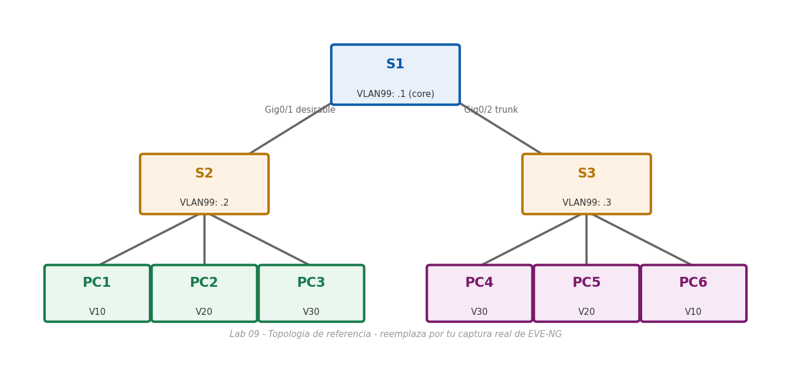

# Lab 09 — Configuración de DTP

> Basado en la práctica *Configuración de DTP* de NetAcad, adaptada para EVE-NG con Cisco IOS real. El enunciado original no se incluye por derechos de autor de Cisco/NetAcad; esta es mi solución de configuración y verificación.

## Objetivo

Configurar enlaces troncales entre tres switches (S1 como núcleo, S2 y S3 como acceso) combinando negociación DTP (`dynamic desirable`) y un troncal estático (`switchport nonegotiate`), y diagnosticar por qué la conectividad de extremo a extremo falla hasta que las VLAN y la VLAN nativa quedan consistentes en los tres switches.

## Topología



*(Imagen de referencia — reemplázala por tu captura real de la topología armada en EVE-NG: S1 en el centro, con S2 y S3 colgando de él, y dos PC de cada VLAN repartidas entre S2 y S3)*

## Tabla de direccionamiento

| Dispositivo | Interfaz | IP | Máscara |
|---|---|---|---|
| S1 | VLAN 99 | 192.168.99.1 | 255.255.255.0 |
| S2 | VLAN 99 | 192.168.99.2 | 255.255.255.0 |
| S3 | VLAN 99 | 192.168.99.3 | 255.255.255.0 |
| PC1 | NIC | 192.168.10.1 | 255.255.255.0 |
| PC2 | NIC | 192.168.20.1 | 255.255.255.0 |
| PC3 | NIC | 192.168.30.1 | 255.255.255.0 |
| PC4 | NIC | 192.168.30.2 | 255.255.255.0 |
| PC5 | NIC | 192.168.20.2 | 255.255.255.0 |
| PC6 | NIC | 192.168.10.2 | 255.255.255.0 |

**Estado inicial:** S1, S2 y S3 ya tienen creadas las VLAN 99 (Management) y 999 (Native).

## Parte 2 — Crear las VLAN de datos en S2 y S3

```bash
configure terminal
vlan 10
 name Red
vlan 20
 name Blue
vlan 30
 name Yellow
end
copy running-config startup-config
```

*(Mismo bloque en S2 y en S3.)*

## Parte 3 — Asignar VLAN a los puertos (S2 y S3, misma asignación en ambos)

```bash
configure terminal
interface range f0/1-8
 switchport mode access
 switchport access vlan 10
 exit
interface range f0/9-16
 switchport mode access
 switchport access vlan 20
 exit
interface range f0/17-24
 switchport mode access
 switchport access vlan 30
 exit
end
copy running-config startup-config
```

**Ping de PC1 a PC6 en este punto:** falla. Ambas están en VLAN 10, pero PC1 cuelga de S2 y PC6 de S3 — sin un troncal que una S2, S1 y S3, cada switch aísla su VLAN 10 igual que en el Lab 07.

## Parte 4 — Configurar los enlaces troncales

**En S1, hacia S2 (negociado con DTP):**

```bash
configure terminal
interface g0/1
 switchport mode dynamic desirable
 exit
end
```

Con S2 en su modo por defecto (`dynamic auto`), la negociación DTP entre `desirable` (S1) y `auto` (S2) sí forma el troncal automáticamente. Verifícalo con `show interfaces trunk` en S2: `Gig0/1` debe aparecer como `trunking`.

**En S1, hacia S3 (troncal estático, sin negociación):**

```bash
configure terminal
interface g0/2
 switchport mode trunk
 switchport nonegotiate
 exit
end
```

`switchport nonegotiate` hace que S1 deje de enviar tramas DTP por ese puerto — por eso el otro extremo (S3) **debe** configurarse también de forma manual; si S3 se queda en su modo por defecto (`dynamic auto`), nunca llegará a formar el troncal porque no recibirá negociación DTP y no está fijado como troncal por sí solo. Verifícalo:

```bash
show dtp
show interfaces trunk
```

## Parte 4 (cont.) — Cambiar la VLAN nativa a 999 en los tres switches

```bash
! En S1
configure terminal
interface range g0/1-2
 switchport trunk native vlan 999
 exit
end

! En S2
configure terminal
interface g0/1
 switchport trunk native vlan 999
 exit
end

! En S3
configure terminal
interface g0/2
 switchport trunk native vlan 999
 exit
end
copy running-config startup-config
```

Al fijar la VLAN nativa en S1 antes que en el otro extremo, IOS genera un mensaje `%CDP-4-NATIVE_VLAN_MISMATCH` (S1 anuncia nativa 999 mientras el vecino todavía anuncia nativa 1/1000) — se corrige en cuanto el otro lado también queda en 999.

## Diagnóstico — por qué siguen fallando los pings entre PC1 y PC6

Con los tres switches en modo troncal y la VLAN nativa ya alineada, un ping entre PC1 (VLAN 10, en S2) y PC6 (VLAN 10, en S3) **todavía puede fallar** por una causa que un `show vlan brief` revela de inmediato: **S1 nunca tuvo creadas las VLAN 10, 20 y 30 en su propia base de datos** (solo se crearon en S2 y S3). Aunque S1 no tenga puertos de acceso en esas VLAN, actúa como tránsito entre S2 y S3 — y un switch IOS descarta el tráfico etiquetado con una VLAN que no existe en su base de datos local, aunque el puerto sea troncal.

**Corrección:**

```bash
! En S1
configure terminal
vlan 10
 name Red
vlan 20
 name Blue
vlan 30
 name Yellow
end
copy running-config startup-config
```

## Parte 5 — Alinear el modo de G0/2 en S3 con S1

Si al revisar `show interface trunk` en S3 el puerto `G0/2` aparece con un modo o encapsulación distintos a los de S1 (por ejemplo, todavía en `auto` en vez de `on`/`trunk`), se iguala manualmente:

```bash
configure terminal
interface g0/2
 switchport mode trunk
 exit
end
copy running-config startup-config
```

Verifica el estado de negociación:

```bash
show interface g0/2 switchport
```

Con `switchport nonegotiate` en el extremo de S1, el campo "Negotiation of Trunking" en S3 debe mostrarse como deshabilitado una vez que ambos lados están fijados manualmente en modo troncal.

## Verificación final (Parte 6)

```bash
PC1> ping 192.168.10.2   ! PC6 (VLAN 10)
PC2> ping 192.168.20.2   ! PC5 (VLAN 20)
PC3> ping 192.168.30.2   ! PC4 (VLAN 30)
```

Los tres deben responder correctamente una vez que: (1) los tres switches tienen las mismas VLAN en su base de datos, (2) ambos extremos de cada troncal están en modo `trunk` (sin depender de una negociación DTP a medias), y (3) la VLAN nativa coincide en 999 en todos los enlaces.

## Notas de diseño

- **DTP no reemplaza la planeación:** que un troncal "suba" por negociación automática no garantiza que esté bien diseñado — VLAN nativa distinta, o VLAN faltantes en algún switch de tránsito, son errores que DTP no detecta ni corrige por sí solo.
- **`nonegotiate` es una decisión de seguridad, no solo de conveniencia:** al desactivar DTP en un puerto, ese puerto deja de anunciarse como candidato a troncal, lo que reduce la superficie de ataque de VLAN hopping vía DTP spoofing — el costo es que el otro extremo debe configurarse manualmente, sin margen de negociación automática.
- **Un switch de tránsito necesita las VLAN "de paso":** aunque S1 no tenga ni un solo host en VLAN 10/20/30, sigue siendo responsable de reenviar ese tráfico entre S2 y S3, y para eso el switch exige que la VLAN exista (activa) en su propia base de datos, esté o no siendo usada localmente.
