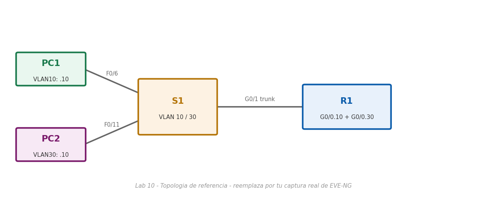

# Lab 10 — Enrutamiento entre VLAN con Router-on-a-Stick

> Basado en la práctica *Configurar Enrutamiento entre VLANS usando Router-on-a-Stick* de NetAcad, adaptada para EVE-NG con Cisco IOS real. El enunciado original no se incluye por derechos de autor de Cisco/NetAcad; esta es mi solución de configuración y verificación.

## Objetivo

Permitir que dos hosts en VLAN distintas (10 y 30), conectadas al mismo switch de acceso, se comuniquen entre sí a través de un único enlace físico del router mediante subinterfaces 802.1Q (Router-on-a-Stick).

## Topología



*(Imagen de referencia — reemplázala por tu captura real de la topología armada en EVE-NG: PC1 y PC2 en S1, S1 conectado a R1 por un enlace troncal)*

## Tabla de direccionamiento

| Dispositivo | Interfaz | IPv4 | Máscara | Gateway |
|---|---|---|---|---|
| R1 | G0/0.10 | 172.17.10.1 | 255.255.255.0 | N/D |
| R1 | G0/0.30 | 172.17.30.1 | 255.255.255.0 | N/D |
| PC1 | NIC | 172.17.10.10 | 255.255.255.0 | 172.17.10.1 |
| PC2 | NIC | 172.17.30.10 | 255.255.255.0 | 172.17.30.1 |

## Parte 1 — VLAN en S1 y asignación de puertos

```bash
enable
configure terminal
vlan 10
 exit
vlan 30
 exit

interface f0/6
 switchport mode access
 switchport access vlan 10
 exit
interface f0/11
 switchport mode access
 switchport access vlan 30
 exit
end
copy running-config startup-config
```

Verifica con `show vlan brief`. En este punto, un ping entre PC1 y PC2 falla: están en redes IP distintas (172.17.10.0/24 y 172.17.30.0/24) y ningún dispositivo de Capa 3 las conecta todavía.

## Parte 2 — Subinterfaces 802.1Q en R1

```bash
configure terminal

interface GigabitEthernet0/0.10
 encapsulation dot1Q 10
 ip address 172.17.10.1 255.255.255.0
 exit

interface GigabitEthernet0/0.30
 encapsulation dot1Q 30
 ip address 172.17.30.1 255.255.255.0
 exit

! Las subinterfaces dependen de que la interfaz física esté activa
interface GigabitEthernet0/0
 no shutdown
 exit

end
copy running-config startup-config
```

Verifica con `show ip interface brief`: ambas subinterfaces deben pasar a `up/up` en cuanto `GigabitEthernet0/0` (la interfaz física) queda activa — una subinterfaz nunca sube por sí sola si su interfaz padre está apagada.

## Parte 3 — Habilitar el troncal hacia R1 y probar la conectividad

Aunque R1 ya tiene sus subinterfaces listas, el ping entre PC1 y PC2 **sigue fallando** en este punto: el puerto del switch que conecta a R1 (`G0/1`) todavía es un puerto de acceso en VLAN 1, y R1 está enviando/esperando tráfico etiquetado 802.1Q para las VLAN 10 y 30. Se soluciona convirtiendo ese puerto en troncal:

```bash
! En S1
configure terminal
interface g0/1
 switchport mode trunk
 exit
end
copy running-config startup-config
```

Verifica:
```bash
show vlan brief          ! G0/1 ya no aparece listado en ninguna VLAN de acceso
show interface trunk     ! confirma que G0/1 está "trunking"
```

## Solución — Hosts

| Host | IP | Máscara | Gateway |
|---|---|---|---|
| PC1 | 172.17.10.10 | 255.255.255.0 | 172.17.10.1 |
| PC2 | 172.17.30.10 | 255.255.255.0 | 172.17.30.1 |

## Verificación final

```bash
PC1> ping 172.17.10.1    ! su propia puerta de enlace (subinterfaz .10)
PC1> ping 172.17.30.1    ! la otra puerta de enlace, a través del router
PC1> ping 172.17.30.10   ! PC2, cruzando VLAN
```

Los tres deben responder correctamente: PC1 y PC2 usan como puerta de enlace predeterminada la subinterfaz de R1 correspondiente a su propia VLAN (172.17.10.1 y 172.17.30.1 respectivamente), y es R1 quien enruta entre ambas subredes.

## Notas de diseño

- **Por qué el router necesita subinterfaces y no una sola IP:** una interfaz física solo puede tener una dirección IP "nativa" por VLAN sin etiquetar; para que el mismo cable físico atienda el tráfico de varias VLAN simultáneamente, cada VLAN necesita su propia subinterfaz lógica con su propia encapsulación 802.1Q y su propia IP — cada una actúa como si fuera la puerta de enlace de una interfaz física distinta.
- **La interfaz física debe estar `no shutdown` aunque no tenga IP propia:** las subinterfaces son constructos lógicos que viven "encima" de la interfaz física; si esta última está administrativamente apagada, ninguna subinterfaz puede pasar a estado `up`, sin importar que cada una esté correctamente configurada.
- **El puerto del switch hacia el router debe ser troncal, no de acceso:** un puerto de acceso solo puede pertenecer a una VLAN; como el router necesita recibir tráfico etiquetado de varias VLAN por el mismo cable, el switch debe entregarle ese tráfico con las etiquetas 802.1Q intactas, lo cual solo ocurre en un puerto troncal.
- **Router-on-a-Stick vs. switch de Capa 3:** este diseño es sencillo y barato (no requiere hardware de conmutación con capacidades de enrutamiento), pero todo el tráfico entre VLAN pasa por un único enlace físico y por la CPU del router, lo que lo hace poco escalable para redes con mucho tráfico inter-VLAN — ahí es donde entra el enrutamiento por switch multicapa (SVI + `ip routing`), tema de labs posteriores.
